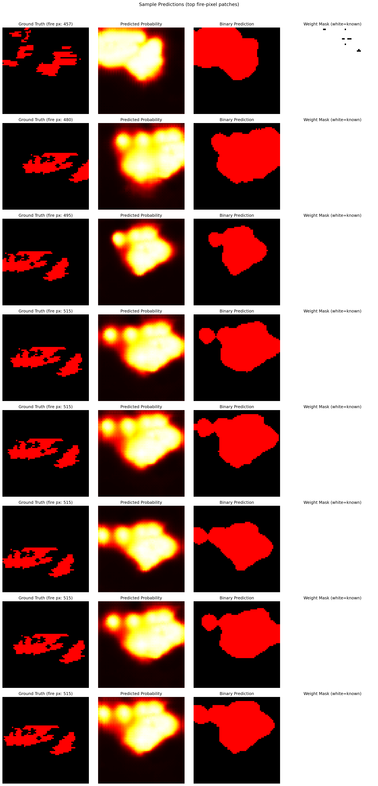
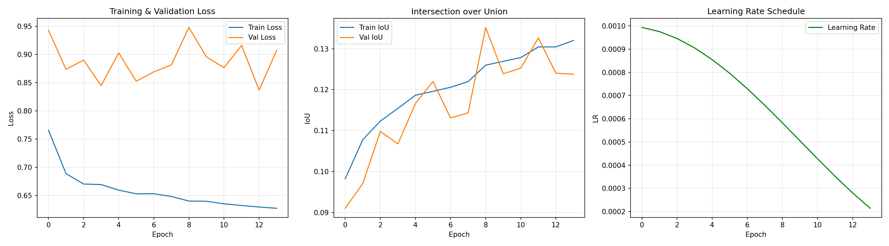
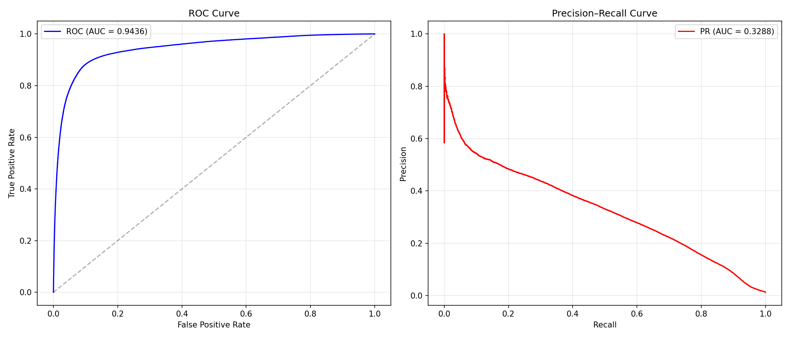
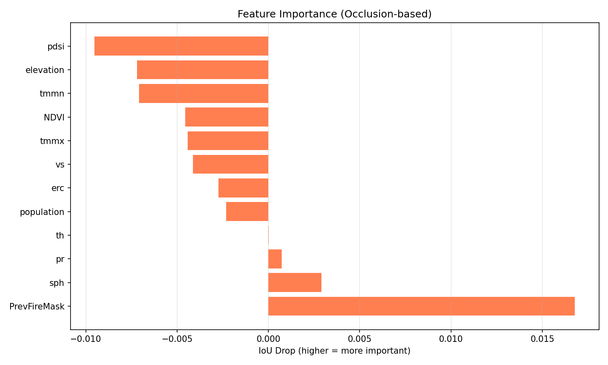

# 🔥 Wildfire Spread Detection CNN

> **Next-day wildfire spread prediction** using 12-channel satellite imagery and an Attention U-Net deep learning model.

  

---

## 📌 What It Does

Given today's satellite snapshot of a location — vegetation, terrain, temperature, wind, humidity — this model predicts a **binary fire mask for tomorrow**: which pixels will be on fire.

| Property | Value |
|---|---|
| Task | Binary semantic segmentation (fire / no-fire) |
| Input | `(12, 64, 64)` multi-channel satellite patch |
| Output | `(1, 64, 64)` fire probability map + binary mask |
| Dataset | [Next Day Wildfire Spread — Kaggle](https://www.kaggle.com/datasets/fantineh/next-day-wildfire-spread) |
| Model | Attention U-Net Lite — 5.26M parameters |

---

## 📊 Results

| Metric | Value |
|---|---|
| Test Accuracy | 93.49% |
| **Fire Recall** | **82.20%** |
| F1 Score | 0.2405 |
| IoU | 0.1367 |
| **ROC-AUC** | **0.9436** |

> High recall (82%) means **4 out of 5 real fire pixels are correctly detected**. Accuracy alone is misleading because 98.8% of pixels are no-fire.

### WEB page 


### Sample Predictions



*Each row: NDVI · Previous Fire · Predicted Probability · Ground Truth · Overlay*

### Training Curves



### ROC & Precision-Recall Curves



### Feature Importance



*PrevFireMask is the single most predictive feature — 80× more important than the next feature.*

---

## 🌐 Web Application


A dark-theme Flask dashboard where any user can upload a `.npy` satellite patch and get an instant prediction with:
- 🔴 Risk badge (LOW / MEDIUM / HIGH)
- 📊 Stats: fire pixels, coverage %, max probability
- 🖼️ 4-panel prediction image
- 🗺️ 12-channel feature grid
- 🎯 Demo mode (auto-selects a fire sample from test set)

---

## 🧠 Model Architecture

```
Input (12×64×64)
      │
  Encoder ×4      12 → 32 → 64 → 128 → 256 channels  (MaxPool)
      │
  Bottleneck       SE Block (channel-wise attention)
      │
  Decoder ×4       UpConv + Attention Gate on each skip connection
      │
  Head             1×1 Conv → sigmoid → (1×64×64) fire probability
```

**Key design choices:**
- **Attention Gates** — skip connections filtered spatially; decoder focuses on fire boundaries
- **SE Block** — automatically upweights channels like ERC and PrevFireMask near fires
- **Masked BCE + Dice Loss** — cloud/sensor gaps excluded from training
- **pos_weight = 85.11** — counteracts 1.16% fire / 98.84% no-fire imbalance

---

## 🛰️ The 12 Input Features

| # | Feature | Source | Description |
|---|---|---|---|
| 1 | NDVI | Landsat-8 | Vegetation greenness |
| 2 | elevation | SRTM | Terrain height (m) |
| 3 | th | PRISM | Wind direction (°) |
| 4 | vs | MERRA-2 | Wind speed (m/s) |
| 5 | tmmn | GRIDMET | Min temperature (K) |
| 6 | tmmx | GRIDMET | Max temperature (K) |
| 7 | sph | MERRA-2 | Specific humidity (kg/kg) |
| 8 | pr | GRIDMET | Precipitation (mm) |
| 9 | pdsi | NOAA CPC | Palmer Drought Index |
| 10 | erc | GRIDMET | Energy Release Component |
| 11 | population | Facebook/CIESIN | Population density |
| 12 | PrevFireMask | MODIS | Previous day fire mask |

---

## 🚀 Quick Start

```bash
# 1. Clone
git clone https://github.com/YOUR_USERNAME/Wildfire-Detection-CNN.git
cd Wildfire-Detection-CNN

# 2. Install dependencies
pip install -r requirements.txt

# 3. Download dataset (requires Kaggle API key)
python src/download_dataset.py

# 4. Train
python src/train.py --epochs 20 --batch_size 32 --model_name unet_lite --train_shards 10

# 5. Evaluate
python src/evaluate.py --model_name unet_lite

# 6. Launch web app
python webapp/app.py
# → http://127.0.0.1:5000
```

**Predict on your own file:**
```bash
python src/predict.py --checkpoint checkpoints/best_model.pth
```

---

## 🏗️ Project Structure

```
Wildfire-Detection-CNN/
├── src/
│   ├── data_loader.py        # TFRecord → PyTorch Dataset (lazy streaming)
│   ├── models.py             # Attention U-Net + SE Block + Masked Loss
│   ├── train.py              # AdamW + CosineAnneal + AMP training loop
│   ├── evaluate.py           # Metrics, ROC/PR curves, feature importance
│   └── predict.py            # Inference + risk report
├── webapp/
│   ├── app.py                # Flask backend
│   └── templates/
│       ├── index.html        # Dark-theme prediction dashboard
│       └── about.html        # Project info
├── notebooks/
│   └── 01_EDA.ipynb          # EDA + interactive prediction (Section 11)
├── checkpoints/
│   ├── data_info.json        # Normalisation statistics (required for inference)
│   └── training_history.json
├── results/                  # Plots and metrics
├── presentation/
│   └── wildfire_presentation.pdf
└── requirements.txt
```

---

## 📚 References

- Huot et al. (2022) — [Next Day Wildfire Spread Dataset](https://www.kaggle.com/datasets/fantineh/next-day-wildfire-spread)
- Ronneberger et al. (2015) — U-Net
- Oktay et al. (2018) — Attention U-Net
- Hu et al. (2018) — Squeeze-and-Excitation Networks
